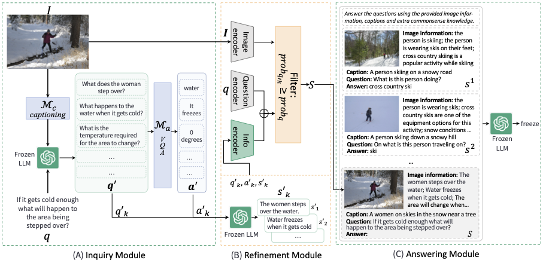

This is the repo for "Filling the Image Information Gap for VQA: Prompting Large Language Models to Proactively Ask Questions" (EMNLP 2023 Findings) [paper](https://arxiv.org/abs/2311.11598)



# Installation
coming soon

# Examples
coming soon

# Bibtex
If you find our projects helpful to your research, please consider citing:
```
@misc{wang2023filling,
      title={Filling the Image Information Gap for VQA: Prompting Large Language Models to Proactively Ask Questions},
      author={Ziyue Wang and Chi Chen and Peng Li and Yang Liu},
      year={2023},
      eprint={2311.11598},
      archivePrefix={arXiv},
      primaryClass={cs.CL}
}
```
